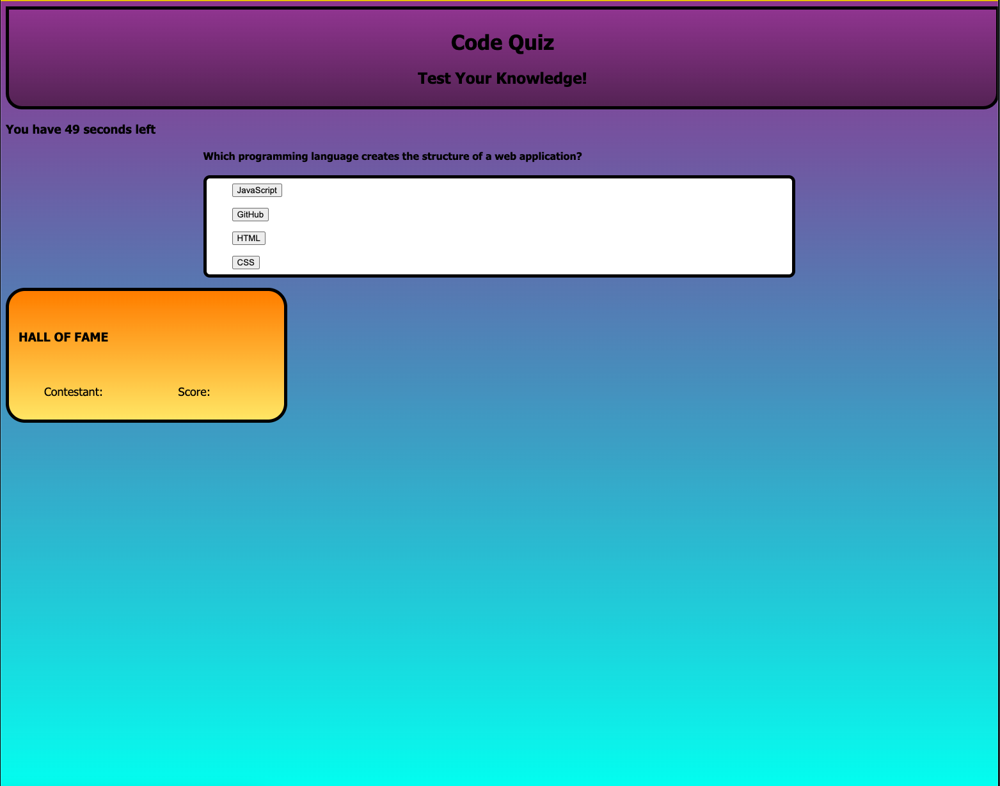

# README
# Mark Barstow / module-4-challenge
# Goals
## Using methods to integrate HTML structure for use in JavaScript
- There are many uses for methods within JavaScript, and in this assignment, the most common methods I used were those that manipulated the HTML content.

       let x = document.getElementById("")
    is very useful to assign value to a variable.

        pageEl.textContent
    will change the text that is displayed within the referenced HTML element.

## Setting Time Intervals within JavaScript
- The acceptance criteria detailed the necessity to use a timer for the quiz. This is done through the following syntax:
        
        var timerInterval = setInterval(function() {}, 1000)
    in order to implement a time penalty on any incorrect answer, an if/then conditional statement was used to determine the validity of an answer. If incorrect, the variable of 

            secondsLeft
    would be deducted an extra 5 units of time.

## Storing value in localStorage

- Using

        localStorage.setItem
    and 

        localStorage.getItem
    we can successfully store the values of 
        
        score: ,
        initials: ,
    so that they may be referenced later upon the refresh of the page.

# Challenges and Application

- The toughest challenge for me was storing data in 

        localStorage
    As of my submission of this project, I believe that it still is not storing the data properly within my 

        scoreList
    array.
- Other than that there are limited question objects created at this point, but I believe that there are enough available to display the application's functionality. 

# Webpage Deployment
- the link to the deployed GitHub Pages website is [here](https://marchetype.github.io/module-4-challenge/).

- Screenshot of deployed site:
